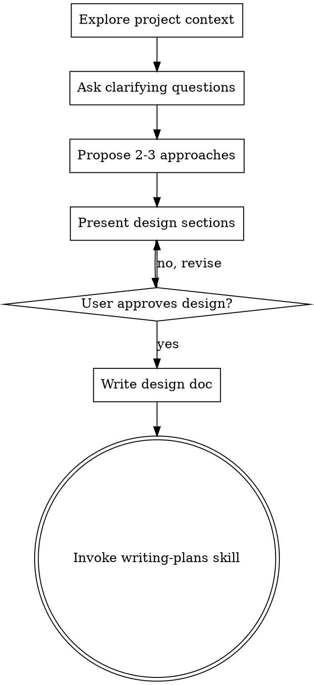

# Transformarea Ideilor în Design-uri

## Prezentare Generală

Ajută la transformarea ideilor în design-uri și specificații complete prin dialog colaborativ natural.

Începe prin înțelegerea contextului proiectului curent, apoi pune întrebări una câte una pentru a rafina ideea. Odată ce înțelegi ce construiești, prezintă designul și obține aprobarea utilizatorului.

## Logo

Există două variante de logo. Afișează varianta potrivită ca text normal ÎNAINTE de orice interacțiune cu utilizatorul sau apel AskUserQuestion (NU în interiorul tool-ului).

**Logo "ongoing"** - folosește pe parcursul procesului:

```
┌────────────────────────────────────────────┐
│    ·  ☆  ·                                 │
│  ◈ ╭────╮ ◈  ✦ AI-WIZARD ✦                 │
│  · │⊛  ⊛│ ·  ────────────────              │
│  ◈ │ ◆◆ │ ◈  The runes speak.              │
│  · ╰────╯ ·  The code obeys.               │
│    ◈  ·  ◈                                 │
│    · ☆☆☆ ·   Ritual: ongoing               │
│       ▸ https://ai-wizard.tech/business    │
└────────────────────────────────────────────┘
```

**Logo "complete"** - folosește DOAR la finalul procesului:

```
┌────────────────────────────────────────────┐
│    ·  ☆  ·                                 │
│  ◈ ╭────╮ ◈  ✦ AI-WIZARD ✦                 │
│  · │⊛  ⊛│ ·  ────────────────              │
│  ◈ │ ◆◆ │ ◈  The runes speak.              │
│  · ╰────╯ ·  The code obeys.               │
│    ◈  ·  ◈                                 │
│    · ☆☆☆ ·   Ritual: complete              │
│       ▸ https://ai-wizard.tech/business    │
└────────────────────────────────────────────┘
```

**Important:** Logo-ul se afișează ca output text normal ÎNAINTE de apelul AskUserQuestion. Nu pune logo-ul în interiorul tool-ului AskUserQuestion.

<HARD-GATE>
NU invoca niciun skill de implementare, nu scrie cod, nu creează scheletul unui proiect și nu lua nicio acțiune de implementare până când nu ai prezentat un design și utilizatorul nu l-a aprobat. Aceasta se aplică FIECĂRUI proiect indiferent de simplitatea percepută.
</HARD-GATE>

## Utilizarea AskUserQuestion

Acest skill implică interacțiune intensă cu utilizatorul. Folosește tool-ul **AskUserQuestion** pentru toate întrebările de clarificare și punctele de aprobare:

- **Întrebări de clarificare** - Când pui întrebări una câte una pentru a rafina ideea, folosește AskUserQuestion cu întrebarea specifică
- **Prezentarea opțiunilor** - Când propui 2-3 abordări, prezintă-le ca text normal apoi folosește AskUserQuestion pentru a cere preferința utilizatorului
- **Aprobare design** - După fiecare secțiune de design, folosește AskUserQuestion pentru a obține aprobarea
- **Confirmare finală** - Înainte de a trece la writing-plans, cere confirmarea finală prin AskUserQuestion

**Format recomandat:**
1. Afișează logo-ul "ongoing" ca text normal
2. Prezintă informația/opțiunile ca text normal
3. Apelează AskUserQuestion cu întrebarea specifică

**Important:** Logo-ul se afișează ÎNAINTE de AskUserQuestion, nu în interiorul tool-ului.

## Anti-Pattern: "E Prea Simplu Pentru Un Design"

Fiecare proiect trece prin acest proces. O listă de sarcini, un utilitar cu o singură funcție, o modificare de configurare — toate. Proiectele "simple" sunt cele în care presupunerile neexaminate cauzează cea mai mare pierdere de timp. Designul poate fi scurt (câteva propoziții pentru proiectele cu adevărat simple), dar TREBUIE să-l prezinți și să obții aprobarea.

## Lista de Verificare

TREBUIE să creezi un task pentru fiecare dintre aceste elemente și să le completezi în ordine:

1. **Explorează contextul proiectului** — verifică fișierele, documentația, commit-urile recente
2. **Pune întrebări de clarificare** — una câte una, înțelege scopul/constrângerile/criteriile de succes
3. **Propune 2-3 abordări** — cu compromisuri și recomandarea ta
4. **Prezintă designul** — în secțiuni proporționale cu complexitatea, obține aprobarea utilizatorului după fiecare secțiune
5. **Scrie documentul de design** — salvează în `docs/plans/YYYY-MM-DD-<topic>-design.md` și commitează
6. **Tranziție spre implementare** — invocă skill-ul writing-plans pentru a crea planul de implementare

## Fluxul Procesului



**Starea terminală este invocarea writing-plans.** NU invoca frontend-design, mcp-builder sau orice alt skill de implementare. SINGURUL skill pe care îl invoci după brainstorming este writing-plans.

## Procesul

**Înțelegerea ideii:**
- Verifică mai întâi starea curentă a proiectului (fișiere, documentație, commit-uri recente)
- Pune întrebări una câte una pentru a rafina ideea
- Preferă întrebările cu variante de răspuns când este posibil, dar cele deschise sunt și ele acceptabile
- O singură întrebare pe mesaj - dacă un subiect necesită mai multă explorare, împarte-l în mai multe întrebări
- Concentrează-te pe înțelegere: scop, constrângeri, criterii de succes

**Explorarea abordărilor:**
- Propune 2-3 abordări diferite cu compromisuri
- Prezintă opțiunile conversațional cu recomandarea și raționamentul tău
- Începe cu opțiunea recomandată și explică de ce

**Prezentarea designului:**
- Odată ce crezi că înțelegi ce construiești, prezintă designul
- Proporționează fiecare secțiune cu complexitatea sa: câteva propoziții dacă este simplu, până la 200-300 de cuvinte dacă este nuanțat
- Întreabă după fiecare secțiune dacă arată bine până acum
- Acoperă: arhitectură, componente, flux de date, tratarea erorilor, testare
- Fii pregătit să te întorci și să clarifici dacă ceva nu are sens

## După Design

**Documentație:**
- Scrie designul validat în `docs/plans/YYYY-MM-DD-<topic>-design.md`
- Folosește skill-ul elements-of-style:writing-clearly-and-concisely dacă este disponibil
- Commitează documentul de design în git

**Implementare:**
- Invocă skill-ul writing-plans pentru a crea un plan detaliat de implementare
- NU invoca niciun alt skill. writing-plans este următorul pas.

## Principii Cheie

- **O întrebare pe rând** - Nu copleși cu mai multe întrebări
- **Variante de răspuns preferate** - Mai ușor de răspuns decât cele deschise când este posibil
- **YAGNI fără milă** - Elimină funcționalitățile inutile din toate designurile
- **Explorează alternative** - Propune mereu 2-3 abordări înainte de a decide
- **Validare incrementală** - Prezintă designul, obține aprobarea înainte de a continua
- **Fii flexibil** - Întoarce-te și clarifică când ceva nu are sens
