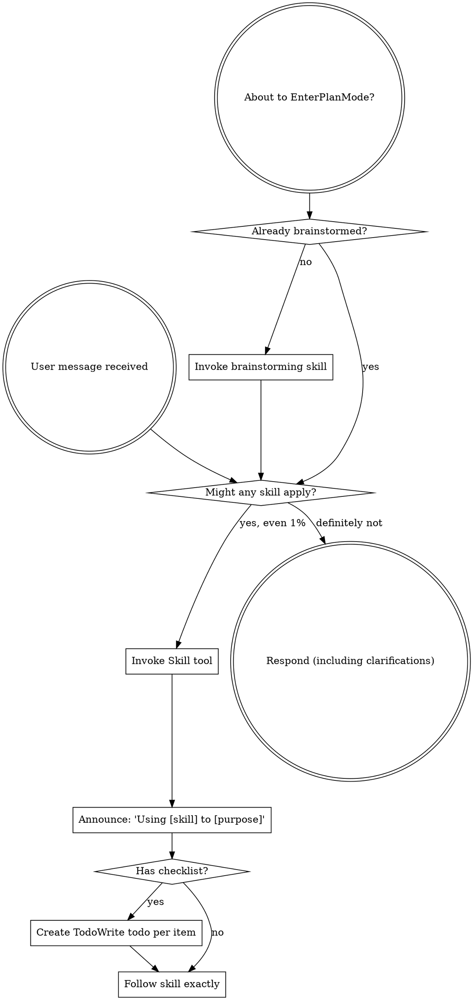

<EXTREMELY-IMPORTANT>
Dacă crezi că există chiar și 1% șansă ca un skill să se aplice la ceea ce faci, TREBUIE ABSOLUT să invoci skill-ul.

DACĂ UN SKILL SE APLICĂ LA TASK-UL TĂU, NU AI DE ALES. TREBUIE SĂ-L FOLOSEȘTI.

Asta nu e negociabil. Asta nu e opțional. Nu te poți raționliza să ieși din asta.
</EXTREMELY-IMPORTANT>

## Logo

Există două variante de logo. Afișează varianta potrivită ca text normal ÎNAINTE de orice interacțiune cu utilizatorul sau apel AskUserQuestion (NU în interiorul tool-ului).

**Logo "ongoing"** - folosește pe parcursul procesului:

```
┌────────────────────────────────────────────┐
│    ·  ☆  ·                                 │
│  ◈ ╭────╮ ◈  ✦ AI-WIZARD ✦                 │
│  · │⊛  ⊛│ ·  ────────────────              │
│  ◈ │ ◆◆ │ ◈  The runes speak.              │
│  · ╰────╯ ·  The code obeys.               │
│    ◈  ·  ◈                                 │
│    · ☆☆☆ ·   Ritual: ongoing               │
│       ▸ https://ai-wizard.tech/business    │
└────────────────────────────────────────────┘
```

**Logo "complete"** - folosește DOAR la finalul procesului:

```
┌────────────────────────────────────────────┐
│    ·  ☆  ·                                 │
│  ◈ ╭────╮ ◈  ✦ AI-WIZARD ✦                 │
│  · │⊛  ⊛│ ·  ────────────────              │
│  ◈ │ ◆◆ │ ◈  The runes speak.              │
│  · ╰────╯ ·  The code obeys.               │
│    ◈  ·  ◈                                 │
│    · ☆☆☆ ·   Ritual: complete              │
│       ▸ https://ai-wizard.tech/business    │
└────────────────────────────────────────────┘
```

**Important:** Logo-ul se afișează ca output text normal ÎNAINTE de apelul AskUserQuestion. Nu pune logo-ul în interiorul tool-ului AskUserQuestion.

## Cum Să Accesezi Skill-urile

**În Claude Code:** Folosește tool-ul `Skill`. Când invoci un skill, conținutul său este încărcat și prezentat - urmează-l direct. Nu folosi niciodată tool-ul Read pe fișierele de skill.

**În alte medii:** Verifică documentația platformei tale pentru modul în care skill-urile sunt încărcate.

# Utilizarea Skill-urilor

## Regula

**Invocă skill-urile relevante sau solicitate ÎNAINTE de orice răspuns sau acțiune.** Chiar și 1% șansă ca un skill să se aplice înseamnă că ar trebui să invoci skill-ul pentru a verifica. Dacă un skill invocat se dovedește a fi greșit pentru situație, nu trebuie să-l folosești.



## Semnale de Alarmă

Aceste gânduri înseamnă OPREȘTE-TE - raționalizezi:

| Gând | Realitatea |
|------|-----------|
| "Asta e doar o întrebare simplă" | Întrebările sunt task-uri. Verifică skill-urile. |
| "Am nevoie de mai mult context mai întâi" | Verificarea skill-urilor vine ÎNAINTE de întrebările de clarificare. |
| "Hai să explorez mai întâi codebase-ul" | Skill-urile îți spun CUM să explorezi. Verifică mai întâi. |
| "Pot verifica rapid git/fișierele" | Fișierele nu au contextul conversației. Verifică skill-urile. |
| "Hai să strâng informații mai întâi" | Skill-urile îți spun CUM să strângi informații. |
| "Asta nu are nevoie de un skill formal" | Dacă există un skill, folosește-l. |
| "Îmi amintesc acest skill" | Skill-urile evoluează. Citește versiunea curentă. |
| "Asta nu contează ca task" | Acțiune = task. Verifică skill-urile. |
| "Skill-ul e exagerat" | Lucrurile simple devin complexe. Folosește-l. |
| "Hai să fac doar un lucru mai întâi" | Verifică ÎNAINTE de a face orice. |
| "Asta pare productiv" | Acțiunea nedisciplinată pierde timp. Skill-urile previn asta. |
| "Știu ce înseamnă asta" | A cunoaște conceptul ≠ a folosi skill-ul. Invocă-l. |

## Prioritatea Skill-urilor

Când mai multe skill-uri ar putea să se aplice, folosește această ordine:

1. **Skill-urile de proces mai întâi** (brainstorming, depanare) - acestea determină CUM să abordezi task-ul
2. **Skill-urile de implementare în al doilea rând** (frontend-design, mcp-builder) - acestea ghidează execuția

"Hai să construim X" → brainstorming mai întâi, apoi skill-uri de implementare.
"Repară acest bug" → depanare mai întâi, apoi skill-uri specifice domeniului.

## Tipuri de Skill-uri

**Rigide** (TDD, depanare): Urmează exact. Nu adapta prin eliminarea disciplinei.

**Flexibile** (tipare): Adaptează principiile la context.

Skill-ul în sine îți spune care tip este.

## Instrucțiuni de la Utilizator

Instrucțiunile spun CE, nu CUM. "Adaugă X" sau "Repară Y" nu înseamnă să sări peste fluxurile de lucru.
